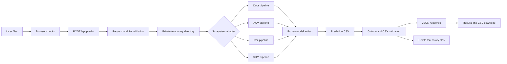
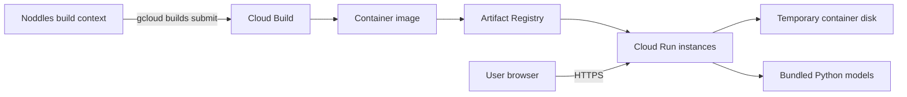
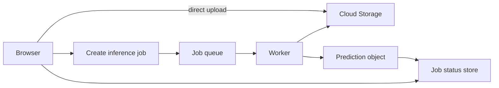

# Train Condition Monitoring: Data Pipeline Design

**Status:** Implemented baseline with proposed production hardening  
**Audience:** Engineers and reviewers with basic data structures and algorithms knowledge  
**Scope:** Data ingestion, validation, feature extraction, model execution, and prediction delivery for Door, ACV, Rail Corrugation, and Structural Health Monitoring (SHM)

## 1. Summary

The application turns uploaded train sensor files into prediction CSVs for four independent condition-monitoring tasks. The browser sends files to a Next.js API. The API places each request in a private temporary directory, starts the appropriate Python pipeline, reads its output CSV, returns the rows as JSON, and deletes the temporary data. The browser then reconstructs the downloadable CSV.

The four pipelines share the same outer flow but intentionally use different feature extraction and prediction logic because their input signals and expected outputs differ.



The current design is synchronous: one HTTP request owns the work from upload through prediction. This keeps the baseline easy to understand and deploy. It is suitable for the hackathon workload, where an upload contains at most one Door file or 20 files for another subsystem and completes within the five-minute process timeout. A queued, object-storage-based design is recommended later for larger or production workloads.

## 2. Goals and non-goals

### Goals

- Accept each subsystem's native CSV or Excel format.
- Reject obviously invalid requests before expensive processing begins.
- Run deterministic inference with frozen model parameters.
- Preserve source filenames where the submission schema requires them.
- Return exactly the columns and filenames expected by the judging system.
- Isolate uploads from concurrent requests and remove them after use.
- Keep training and inference feature definitions consistent.
- Make failures understandable to a non-technical user.

### Non-goals for the current version

- Continuous ingestion from live train telemetry.
- Long-term storage of raw uploads or predictions.
- Distributed feature computation.
- Online model training or automatic model updates.
- Exactly-once processing across request retries.
- Supporting uploads larger than Cloud Run's 32 MiB HTTP/1 request limit.

## 3. Next.js application overview

Next.js is the full-stack web framework around the Python inference code. In this project it has two jobs: it provides the page a user sees in the browser, and it provides server-side HTTP endpoints. It does not replace the data-science pipelines; it coordinates them.

The application uses the Next.js App Router and has three important entry points:

| File | Runs in | Responsibility |
|---|---|---|
| `app/page.tsx` | Web browser | Subsystem selection, drag-and-drop upload, basic extension checks, progress state, result display, and CSV download |
| `app/api/predict/route.ts` | Next.js server | Request validation, temporary file staging, Python process execution, output validation, JSON response, and cleanup |
| `app/api/health/route.ts` | Next.js server | Lightweight deployment health check that confirms all four Python prediction entry points are present |

The browser and server communicate with an ordinary HTTP request:

```text
React page
  -> multipart FormData containing subsystem + files
  -> POST /api/predict
  -> JSON containing output filename + columns + rows
  -> browser renders rows and builds a downloadable CSV
```

Keeping the Python invocation on the server is important. The browser never needs direct access to model files, operating-system paths, or a Python runtime. It also gives the server a trusted boundary at which to repeat validation; client-side checks exist for quick feedback, not security.

The application is configured for Next.js `standalone` output. A production build therefore produces a minimal Node.js server that can be copied into a small runtime container without the complete development dependency tree.

## 4. Local and cloud development

### 4.1 Local development loop

Developers install the root Python dependencies and the app's Node.js dependencies, then run `npm run dev` from `Noddles/app/train-condition-monitoring`. The Next.js development server serves both the React page and API routes, normally at `http://localhost:3000`.

For every prediction request, the server needs a Python interpreter with NumPy, pandas, and openpyxl. Runtime selection follows this order:

1. `PYTHON_EXECUTABLE`, when explicitly configured;
2. the bundled Codex Python runtime;
3. `python`/`python3`; and
4. the Windows `py -3` launcher.

The first compatible interpreter is cached for later requests. `MODEL_ROOT` can similarly override the default location of `Noddles/Optional_Items`. These two environment variables make local development and container deployment use the same application code despite different filesystem layouts.

A normal change cycle is:

1. Change the browser, API, or Python pipeline code.
2. Run the development server and exercise a small representative file.
3. Run the relevant subsystem's `evaluate.py` if feature or model behavior changed.
4. Run `npm run lint` and `npm run build` to catch TypeScript, lint, and production-build problems.
5. Confirm `/api/health` returns `{"status":"ok"}`.

The current health check proves that the four `predict.py` files are mounted. It does not yet load model artifacts, import Python dependencies, or run a sample prediction, so a successful health check is necessary but not a complete end-to-end readiness test.

### 4.2 Production container

`Noddles/app/Dockerfile` creates one image containing both application layers:

```text
Node.js standalone server
├── Next.js page and API routes
├── static browser assets
└── Python virtual environment
    ├── NumPy, pandas, and openpyxl
    ├── four subsystem pipelines
    └── four frozen model artifacts
```

It uses three build stages:

1. **Dependencies:** `npm ci` installs the exact Node.js packages recorded in `package-lock.json`.
2. **Builder:** `npm run build` compiles the Next.js application in standalone mode.
3. **Runner:** a clean image installs Python into `/opt/venv`, copies the standalone server, static assets, pipeline code, and models, and starts `node server.js` on port 8080.

The final process runs as the unprivileged `node` user. `MODEL_ROOT` and `PYTHON_EXECUTABLE` are fixed to container paths so runtime discovery is deterministic.

### 4.3 Google Cloud deployment

The deployment target is Google Cloud Run in `asia-southeast1` by default. The PowerShell deployment script accepts a Google Cloud project ID and optional region and service name. It then:

1. Selects the Google Cloud project.
2. Enables the Cloud Run, Cloud Build, and Artifact Registry APIs.
3. Creates the service's Docker repository in Artifact Registry when it does not yet exist.
4. Sends `Noddles` to Cloud Build using `app/cloudbuild.yaml` and `app/.gcloudignore`.
5. Builds `app/Dockerfile` and stores the resulting container image in Artifact Registry.
6. Deploys the image as a public Cloud Run service.
7. Reads and prints the service URL and its `/api/health` URL.

The deployed service is configured with 2 vCPU, 2 GiB of memory, a ten-minute HTTP timeout, container concurrency of one, and at most eight instances. Concurrency one is a deliberate data-pipeline choice: a large Rail FFT or SHM series cannot compete with another heavy request for memory and CPU inside the same container. Cloud Run provides horizontal scaling by starting separate container instances when requests overlap.



Cloud Build is part of deployment, not the sensor-data path. At runtime, uploaded data travels from the user's browser directly to a Cloud Run instance. It is written only to that instance's temporary filesystem, processed there, returned to the browser, and deleted by the request cleanup logic. Artifact Registry stores application images and model files embedded in those images; it does not store user uploads.

For a cloud release, the expected verification sequence is:

1. From `Noddles/app`, deploy with `scripts/deploy-gcp.ps1 -ProjectId <project>`.
2. Check the printed `/api/health` endpoint.
3. Run one small known input through each subsystem.
4. Confirm the displayed result and downloaded CSV schema.
5. Inspect Cloud Run logs for unexpected errors or timeouts.

## 5. Main data contracts

The subsystem identifier is the routing key. It selects the accepted file type, maximum batch size, Python entry point, model artifact, and output schema.

| Subsystem | Input | Maximum files per request | Processing unit | Output file | Output columns |
|---|---|---:|---|---|---|
| Door | `.csv` continuous stream | 1 | Detected door cycle | `door_predictions.csv` | `start_time`, `end_time`, `prediction` |
| ACV | `.xlsx` case workbook | 20 | One workbook | `acv_predictions.csv` | `file_id`, `ranked_cars` |
| Rail Corrugation | `.csv` signal file | 20 | One file | `rail_predictions.csv` | `file_id`, `prediction` |
| SHM | `.csv` stress series | 20 | One file | `shm_predictions.csv` | `file_id`, `prediction` |

Expected prediction values are:

- Door: `Normal` or `Abnormal resistance` for every detected time segment.
- ACV: every car identifier, ordered from most to least likely faulty and joined with `|`.
- Rail Corrugation: `Normal`, `Side I`, or `Side II`.
- SHM: a finite positive numeric damage estimate.

The model artifacts are JSON files. They contain an ordered `feature_names` list plus model parameters such as means, scales, weights, intercepts, and decision thresholds. At load time, each Python pipeline compares the artifact's feature list with the feature list in code. A mismatch stops the request rather than silently feeding values into the wrong model columns.

## 6. Online inference pipeline

### 6.1 Request admission

The browser performs a convenience check on file extensions. The API repeats all important checks because browser checks can be bypassed.

The API:

1. Confirms that the subsystem is one of `door`, `acv`, `rail`, or `shm`.
2. Removes empty file entries.
3. Enforces the subsystem's file-count limit.
4. Converts each supplied name to a safe base filename.
5. Rejects duplicate filenames using a case-insensitive set.
6. Rejects unsupported extensions.

A set is used for duplicate detection because membership tests are approximately constant time. For `n` files, duplicate checking therefore takes `O(n)` time and `O(n)` extra space. A pairwise comparison would take `O(n^2)` time.

The current handler calls `request.formData()` and then `file.arrayBuffer()`, so request bodies are buffered in memory before being written. This is acceptable under the present upload limit but is an important scaling constraint.

### 6.2 Request isolation and staging

Every request creates a uniquely named directory under the operating system's temporary directory:

```text
noddles-<subsystem>-<random>/
├── input/
│   └── uploaded files
└── <subsystem>_predictions.csv
```

Uploaded files are written to `input/`. The random parent directory prevents two requests with the same source filename from overwriting one another. Only the child Python process for that request receives these paths.

Cleanup occurs in a `finally` block, so the directory is recursively removed after success or failure. The application does not deliberately retain raw sensor data.

### 6.3 Adapter dispatch

The API maps the subsystem to a configuration record rather than using four separate routes. It then starts the corresponding `predict.py` with an argument list, not a shell command string. This avoids shell interpretation of filenames.

```text
python predict.py --input <file-or-directory> --output <csv> [--weights <artifact>]
```

Door receives the path of its single CSV. The other pipelines receive the request's input directory and enumerate matching files. The child process has a five-minute timeout and a 4 MiB stdout/stderr buffer.

The Node.js layer chooses a Python runtime once and caches that choice. A usable runtime must import NumPy, pandas, and openpyxl. In the container, the runtime and model root are explicit environment variables, which removes machine-specific path discovery.

### 6.4 Result validation and delivery

Each Python adapter writes a CSV with a fixed column order. The API then:

1. Removes an optional byte-order mark.
2. Parses CSV quoting and escaped quotes.
3. Requires the header to exactly equal the configured header.
4. Requires every row to have the same number of values as the header.
5. Requires at least one result row.
6. Converts numeric `prediction` fields to JSON numbers when possible.

The API returns the rows and ordered column list as JSON. The browser uses that same order to display the result and create the downloadable CSV.

This validation currently checks shape, not every business rule. Section 11 proposes semantic checks such as allowed labels, finite SHM predictions, complete ACV rankings, and ordered Door timestamps.

## 7. Subsystem transformations

### 7.1 Door: stream to time segments

**Input shape:** A time-ordered table of motor current, voltage, back-EMF, door position, and optional controller-state columns.

The pipeline parses the custom timestamp and scans the stream once. A new segment begins when the time difference from the previous row is greater than a data-derived threshold. The threshold is at least one second and otherwise 20 times the median positive sampling interval. Segments shorter than three rows are discarded.

Each segment is an array-like table slice. Feature extraction reduces it to a fixed 25-number vector containing:

- operation direction and duration;
- current mean, peak, RMS, quantiles, and area;
- voltage and back-EMF statistics;
- door-position range and speed;
- stall fraction;
- mean current in five equal progress phases; and
- the slope between current and position.

The feature vector is standardized and passed to logistic regression. A sigmoid converts the weighted sum to an abnormal-resistance probability, and a frozen threshold converts that probability to a label. Segment endpoints become `start_time` and `end_time`.

For `r` input rows and `f = 25` features, segmentation and feature extraction take `O(r)` time. The implementation currently stores the whole CSV and a list of segment copies, so peak space is `O(r)`. A streaming implementation could reduce additional space but would make quantiles and segment-level feature calculation more complex.

### 7.2 ACV: workbook to ranked cars

**Input shape:** An Excel workbook with time-series columns whose headers identify both a car and a parameter.

Column names are parsed into a dictionary keyed by car identifier. The parser preserves identifiers such as `03` exactly because they appear in the output contract. Parameter names vary between workbooks, so a small ordered keyword map resolves equivalent temperature, target, running-mode, load, and validity signals.

For each car, the other cars form a peer reference. At every timestamp the pipeline compares that car's indoor temperature with the median of its peers. It then summarizes persistent deviation, trend, time beyond a robust threshold, target-temperature offset, cooling recovery, operating-mode difference, load-halving difference, and missing-data rate.

The result is a matrix with one row per car and nine feature columns. Each column is robustly standardized across the cars using its median and median absolute deviation. Missing evidence becomes zero, meaning neutral rather than automatically faulty. A weighted sum produces one anomaly score per car, and sorting the scores in descending order produces the ranking.

If there are `c` cars, `t` timestamps, and `k = 9` final features, the main work is approximately `O(c^2 t)` in the current implementation because a peer median is recomputed while excluding each car. Since a train has only about eight cars, this is intentionally simpler than maintaining a more complex incremental median structure. Final sorting costs `O(c log c)`.

### 7.3 Rail Corrugation: high-rate signals to class

**Input shape:** A table sampled at 10 kHz containing a rotating-speed pulse and vibration/shock channels for multiple bearing positions.

The pipeline estimates train speed by counting changes in the rotating-speed pulse and using the known wheel diameter and encoder-tooth count. A regular expression groups sensor columns by signal kind (`Vibration` or `Shock`) and side. Odd bearing positions map to Side I and even positions to Side II.

For each of the four groups, the pipeline removes the mean and calculates time-domain statistics. A real-valued Fast Fourier Transform (FFT) converts each channel from time samples into frequency energy. Frequency is converted to spatial wavelength with:

```text
wavelength = train speed / frequency
```

The pipeline summarizes energy in five wavelength bands, dominant wavelength, spectral entropy, RMS, kurtosis, crest factor, and variation across sensors. It also calculates Side-I-versus-Side-II contrast features. Together with speed, this produces a fixed 85-number vector.

Prediction is hierarchical:

1. A binary logistic model decides `Normal` versus any corrugation.
2. If faulty, a second binary model decides `Side I` versus `Side II`.

For `r` samples and `c` signal channels, the FFT dominates runtime at `O(c r log r)`. The loaded table and frequency arrays require `O(c r)` space. This is the most CPU- and memory-intensive pipeline.

### 7.4 SHM: stress series to damage estimate

**Input shape:** A headerless CSV whose first column is a dynamic stress time series.

The loader converts values to numbers, rejects files with fewer than four samples, and subtracts the median because a constant offset does not contribute to alternating stress in the chosen fatigue model.

The pipeline removes repeated neighboring values and retains endpoints and local extrema. A stack then performs four-point rainflow counting. A stack is useful here because the algorithm repeatedly compares and removes only the most recent turning points. Each point is pushed and removed at most a small number of times, so the rainflow pass is `O(r)` time and `O(r)` worst-case space.

Cycle ranges are converted to amplitudes. For S-N exponents 2 through 8, the pipeline computes damage proxies of the form:

```text
sum(cycle_count × amplitude^exponent)
```

It adds stress magnitude, distribution, cycle-count, and normalized spectral-band features, producing a fixed 20-number vector. A ridge regression predicts log damage; exponentiation returns the positive damage estimate. Large signals are downsampled before the FFT to cap spectral work at 131,072 samples, while rainflow counting still uses the full series.

Without the capped FFT, complexity would be `O(r log r)`; with the cap, the full-series rainflow scan is `O(r)` and the spectral step has a bounded upper cost. The input series itself requires `O(r)` space.

## 8. Offline training pipeline

Training is deliberately separate from request handling. Each subsystem's `evaluate.py` reads labelled training data, invokes the same feature extractor used by inference, evaluates a validation strategy, fits final parameters, and writes a frozen JSON artifact.

| Subsystem | Validation boundary | Fitting approach | Artifact |
|---|---|---|---|
| Door | Five contiguous chronological folds | Class-weighted logistic regression | standardization, weights, intercept, threshold |
| ACV | Leave one entire case out | Random search over non-negative feature weights | nine normalized weights |
| Rail Corrugation | Repeated stratified five-fold splits | Two class-weighted logistic models plus threshold search | two models and two thresholds |
| SHM | Leave one file out | Ridge regression in log-target space plus regularization search | standardization, coefficients, intercept, minimum |

ACV, Rail, and SHM cache expensive extracted features during experimentation. These caches are development accelerators, not serving dependencies. The production container needs only the feature code and final JSON artifacts.

This separation provides two useful guarantees:

- Uploading a file cannot change a deployed model.
- A model can be reproduced by rerunning its training script against a known dataset and code revision.

For stronger reproducibility, future artifacts should also record the training-data version, source commit, creation time, metric results, and a semantic model version.

## 9. Reliability and failure behavior

Failures are contained to one request. Invalid extensions or counts return HTTP 400. Parsing, Python execution, model loading, feature extraction, timeout, and output errors return HTTP 500 with a readable message. Temporary files are deleted in either case.

Important current controls include:

- unique working directories per request;
- safe basename normalization;
- child-process argument arrays instead of shell strings;
- exact feature-schema checks in model loaders;
- exact output-column checks in the API;
- a five-minute child-process timeout;
- Cloud Run concurrency set to one, preventing heavy model runs from competing within one container; and
- a non-root user in the production container.

The API does not currently expose a request identifier or structured stage timings. This makes a failure visible but can make its cause harder to find in aggregated logs.

## 10. Capacity and scaling

The present deployment favors isolation and predictable resource use over maximum throughput. With container concurrency one, a single instance performs one model run at a time. Cloud Run may create more instances, up to the configured maximum of eight. Roughly:

```text
maximum simultaneous runs = instance limit × concurrency = 8 × 1
```

This is appropriate for CPU-heavy FFT and feature work. The trade-off is queueing or new-instance startup during bursts.

Three limits define when the synchronous design should be replaced:

1. The complete multipart request must fit below Cloud Run's 32 MiB HTTP/1 limit.
2. Processing must finish before the five-minute Python timeout and the ten-minute service timeout.
3. Input plus intermediate arrays must fit in the instance's 2 GiB memory.

For larger workloads, the intended evolution is:



Direct object upload removes the API request-size bottleneck. A queue provides backpressure and retry control. A job-status record lets the browser reconnect without keeping one HTTP request open. This design also needs idempotency keys so a retry does not create duplicate jobs.

## 11. Recommended production hardening

The following changes have the highest value without altering the model logic:

1. **Add semantic input validation.** Check required columns, parseability, row counts, monotonic or plausible timestamps, numeric ranges, and workbook car coverage before feature extraction.
2. **Add semantic output validation.** Enforce permitted labels, finite positive SHM predictions, unique file IDs, complete ACV rankings, and valid ordered Door intervals.
3. **Add explicit upload byte limits in the application.** Reject large bodies before buffering them completely when the hosting stack permits streaming enforcement.
4. **Return stable error codes.** For example, `INVALID_SCHEMA`, `MODEL_TIMEOUT`, and `MODEL_ARTIFACT_MISMATCH`, with a separate user-friendly message.
5. **Add structured observability.** Log a generated request ID, subsystem, file count, total bytes, stage durations, row counts, model version, and success/failure. Never log raw sensor rows.
6. **Record artifact provenance.** Store the code revision, data version, validation metric, and checksum beside every model.
7. **Add request cancellation and process-tree termination.** Ensure a disconnected request cannot leave expensive child work running.
8. **Move large jobs to object storage and a queue.** Keep the synchronous path for small interactive runs.

## 12. Testing strategy

Tests should follow the pipeline boundaries rather than only testing final predictions.

- **Unit tests:** timestamp parsing, CSV quoting, filename normalization, rainflow counting, feature ordering, robust z-scores, wavelength bands, and label thresholds.
- **Contract tests:** one minimal valid and several invalid input files per subsystem; exact output filename, header order, labels, and numeric rules.
- **Golden tests:** fixed small inputs whose feature vectors and predictions are stored and compared after code changes.
- **Training-serving consistency tests:** extract features for the same file through the evaluation and prediction entry points and require identical ordered vectors.
- **Failure tests:** malformed files, duplicate names, missing model artifacts, model-schema mismatch, timeouts, and cleanup after exceptions.
- **Load tests:** concurrent Rail files near the upload limit, measuring memory, CPU time, request latency, and autoscaling behavior.
- **Privacy tests:** verify that the temporary directory no longer exists after both successful and failed requests.

## 13. Key design decisions

| Decision | Reason | Trade-off |
|---|---|---|
| One shared API route with a subsystem configuration map | Keeps validation and lifecycle behavior consistent | Subsystem-specific rules must remain explicit in configuration or adapters |
| Python child processes | Reuses the model code directly and isolates failures | Process startup adds latency; stdout is size-limited |
| Frozen JSON model artifacts | Human-readable, portable, and independent of a large ML framework | Large models would need a more efficient format |
| Private temporary directories | Simple request isolation and reliable cleanup | Files are written to disk before processing |
| Synchronous requests | Simple UI and operational model | Limited by request size and timeout |
| Hand-engineered fixed feature vectors | Works with small labelled datasets and is explainable | May miss patterns learned by larger sequence models |
| Hierarchical Rail classifier | Separates fault detection from side localization | An incorrect first-stage `Normal` decision prevents side classification |
| Peer-relative ACV scoring | Uses the seven healthy cars as an internal reference despite few labels | Assumes most cars in a case are healthy and comparable |

## 14. Source map

- Web orchestration: [`app/api/predict/route.ts`](app/train-condition-monitoring/app/api/predict/route.ts)
- Deployment health check: [`app/api/health/route.ts`](app/train-condition-monitoring/app/api/health/route.ts)
- Browser upload and CSV reconstruction: [`app/page.tsx`](app/train-condition-monitoring/app/page.tsx)
- Door features and inference: [`Optional_Items/Door/code/door_pipeline.py`](Optional_Items/Door/code/door_pipeline.py)
- ACV features and ranking: [`Optional_Items/ACV/code/acv_pipeline.py`](Optional_Items/ACV/code/acv_pipeline.py)
- Rail features and inference: [`Optional_Items/Rail Corrugation/code/rail_pipeline.py`](Optional_Items/Rail%20Corrugation/code/rail_pipeline.py)
- SHM features and inference: [`Optional_Items/SHM/code/shm_pipeline.py`](Optional_Items/SHM/code/shm_pipeline.py)
- Deployment container: [`app/Dockerfile`](app/Dockerfile)
- Cloud Build configuration: [`app/cloudbuild.yaml`](app/cloudbuild.yaml)
- Google Cloud deployment script: [`app/scripts/deploy-gcp.ps1`](app/scripts/deploy-gcp.ps1)
