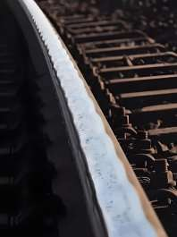
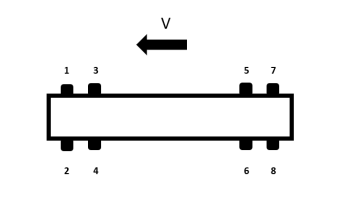

# Documentation of Rail Fault Diagnosis Dataset

*Identification of Abnormal Rail Corrugation*

## 1. Problem Statement

### 1.1 Business Background

Rail corrugation refers to a periodic, approximately equally spaced, irregular wavy wear pattern
that appears longitudinally on the rail running surface during train operation (see Figure 1). It
is one of the most common and challenging rail defects in rail transit. The wavelength typically
ranges from a few centimetres to dozens of centimetres, while the depth can develop from a few
tenths of a millimetre to several millimetres, accompanied by pronounced squealing and
low-frequency rumbling noise, severely degrading ride comfort and the wayside acoustic
environment.

*Figure 1: Rail corrugation image*

The formation mechanism of corrugation is extremely complex, and no single theory can fully
explain all observed phenomena. It is generally believed to result from self-excited coupled
vibration feedback of the wheel-rail system within specific frequency bands: when a train passes,
creep forces and friction-induced vibrations between wheel and rail provoke contact resonance,
leading to uneven plastic flow and accumulated wear on the rail surface. The wavelength is closely
related to sleeper spacing, bogie natural frequencies, and P2 resonance. Meanwhile, metro lines
feature many sharp curves, frequent acceleration and deceleration, relatively light axle loads but
high traffic density, resulting in severe wheel-rail contact stress distribution. Especially on
curves, the attack angle between the leading wheelset and the rail aggravates corrugation on the
inner rail; on straight sections, corrugation is more associated with uneven track elasticity,
rail material, and weld irregularities.

Once rail corrugation develops, it significantly intensifies wheel-rail dynamic forces,
accelerates fatigue damage of fasteners, ballast, and vehicle running gear components, increases
derailment risk, and forces operators to invest substantial resources in milling or grinding
repairs, substantially raising life-cycle maintenance costs. Currently, research and practice on
abnormal rail corrugation detection have become a core focus in the fields of vibration and noise
reduction and safety maintenance in rail transit.

The common detection method uses vibration data collected from axle boxes installed on the train.
Axle-box vibration detection relies on the wheel-rail resonance mechanism: corrugation excitation
generates characteristic-frequency vibrations, measured by trainborne accelerometers (vertical
axle-box acceleration). Time-frequency analysis extracts the dominant wavelength, and combined
with track positioning, enables section identification. This non-contact, efficient,
online-monitoring method is, however, affected by train speed and ballast noise, and requires
signal processing and machine learning to improve accuracy.

### 1.2 Core Problems to be Solved

1. The corrugation formation mechanism is influenced by many confounding factors (sleeper
   spacing, bogie natural frequencies, curve geometry, track elasticity), so simple
   threshold-based detection on raw vibration amplitude is unreliable — the characteristic
   signature must be separated from normal speed- and ballast-dependent vibration.
2. Side I and Side II rails must be judged **independently from the same recording**: a file may
   show corrugation on one side while the other remains normal, so the model must localise the
   fault to a side rather than simply flagging the file as anomalous.
3. The dataset is class-imbalanced (see **Training Dataset** below) — fault cases are a small
   minority of files, which must be accounted for in model training and evaluation.

## 2. Dataset Description

### 2.1 Data File Format and Parameter Description

The train has 8 cars, each with 8 axle boxes (corresponding to 8 wheels), as shown in Figure 2.
Vibration acceleration sensors are installed on the axle boxes to measure axle box vibration and
shock. Positions 1, 3, 5, and 7 correspond to the Side I rail, and positions 2, 4, 6, and 8
correspond to the Side II rail; the states of the Side I and Side II rails must be judged
separately.

*Figure 2: Distribution of axle box positions on the train*

The data format is CSV. Column 1 is rotational speed, acquired by a speed sensor — a toothed
wheel with 90 teeth evenly distributed around the circumference. When a tooth enters and leaves
the detection point, the sensor output toggles between 1 and 0; by counting the 0/1 transitions
over a specific time, the train running speed can be calculated. The wheel diameter is 0.85 m.
Columns 2–129 contain vibration and shock data from the 64 axle boxes, arranged as: Car 1,
Position 1 vibration; Car 1, Position 1 shock; Car 1, Position 2 vibration; Car 1, Position 2
shock; ... Car 1, Position 8 vibration; Car 1, Position 8 shock; ... Car 8, Position 8 vibration;
Car 8, Position 8 shock. The sampling frequency is 10,000 Hz, each file has a duration of 1 s, and
the unit is m/s².

### 2.2 Training Dataset

Training dataset folder (Train): 272 data files in total (`Train1.csv`–`Train272.csv`) - 234
normal files, 14 Side I fault files, and 24 Side II fault files. "Normal" means both Side I and
Side II rails are normal, "Side I" indicates corrugation on the Side I rail while the Side II rail
is normal, and "Side II" indicates corrugation on the Side II rail while the Side I rail is
normal.

Training labels are given in **`Train_Labels.csv`**, alongside the `Train/` folder at the root of
this subsystem's data — one row per file, with `filename` and `label` columns.

### 2.3 Test Dataset

A test dataset of 68 data files (`Test1.csv`–`Test68.csv`) is provided in the "Test" folder, in
the same file format as Train. Reference labels (Normal / Side I / Side II) for these files are
not published here; they are used by the organising committee to independently evaluate submitted
models after the hackathon.

## 3. Your Task and Expected Output

Build a model that classifies each 1-second axle-box vibration/shock recording as **Normal**,
**Side I**, or **Side II** corrugation — a 3-class problem, judging the Side I and Side II rails'
condition together from the same file (see **Data File Format and Parameter Description** above
for which axle-box positions correspond to which side).

Your submitted inference script (`predict.py` — see the top-level README's **Deliverables**
section for the full requirement) must produce a `rail_predictions.csv` with one row per file:

| Column | Value |
|---|---|
| `file_id` | The source file name, including its extension — e.g. `Test1.csv`. |
| `prediction` | `Normal`, `Side I`, or `Side II`. |

See `04_Example_Submission/rail_predictions.csv` for a sample file in this exact format (the
file names and values there are illustrative placeholders, not real data).

This section covers only what your model needs to predict and how to format its output. The
top-level README's **Deliverables** section covers everything else you need to submit — your
development code, the trained model plus `predict.py`, and a short write-up — and the exact
`--input`/`--output` command-line interface `predict.py` must follow.

## 4. Scoring

Rail corrugation is graded on **macro F1** across the three classes (Normal, Side I, Side II) —
not plain accuracy. Macro F1 computes the F1 score for each class independently, then averages the
three unweighted (each class counts equally regardless of how many examples it has).

This matters because the dataset is heavily imbalanced (see **Core Problems to be Solved** above —
only ~9 Side I examples against ~190 Normal in the training data). A model that predicts "Normal"
for every file could score well over 90% plain accuracy while never once correctly detecting a
fault — macro F1 does not reward that: a class the model never gets right (0 recall, 0 precision)
contributes an F1 of 0 to the average, regardless of how rare that class is.

Worked example — a hypothetical model scored on a small held-out set, with per-class F1 scores of:

| Class | F1 score |
|---|---|
| Normal | 0.97 |
| Side I | 0.40 |
| Side II | 0.60 |

**Macro F1 = (0.97 + 0.40 + 0.60) / 3 = 0.657**

A model that instead always predicts "Normal" would score F1 = 0 on both Side I and Side II
(never predicted, so 0 recall for those classes), giving macro F1 = (1.0 + 0 + 0) / 3 ≈ 0.33 even
though its plain accuracy would be roughly 85-90% — this is precisely the gap macro F1 is designed
to expose, and why it is used here instead of accuracy.

Your final Rail score (`primary_metric`) is this macro F1 value. See the top-level Problem
Statement 3 specification's grading-rubric section for how this feeds into the overall Technical
Execution score.
